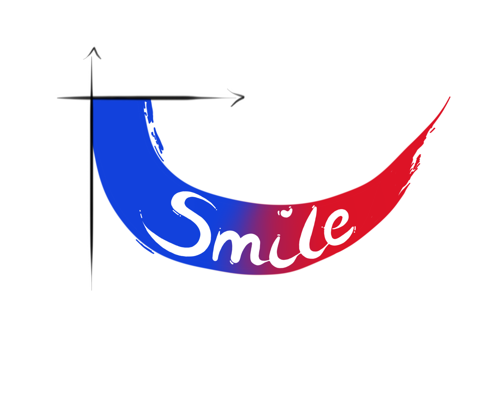

# Usmile 

<!--
Status badges - Update these links once you set up CI/CD and a release!
-->
[](https://github.com/bbwieckowska/Usmile/actions/workflows/R-CMD-check.yaml)
[](https://lifecycle.r-lib.org/articles/stages.html)
[](https://opensource.org/licenses/MIT)
[](https://GitHub.com/bbwieckowska/Usmile/releases/)
<!-- [](https://CRAN.R-project.org/package=Usmile) -->
<!-- [](https://doi.org/...) -->

**User-centric Statistical Measures for Interpretable Learning Explanations**

The `Usmile` R package provides a **threshold-free** and **asymmetric** (class-specific) method for evaluating and comparing binary classifiers, with a focus on biomedical applications and class imbalance. It produces distinctive "smile"-shaped plots that visually reveal class-specific performance improvements or deteriorations, which often remain hidden in traditional metrics like ROC or Precision-Recall curves.

> **💡 Prefer a point-and-click interface? Try the companion Shiny app: [https://barbarawieckowska.shinyapps.io/ShinyApp/](https://barbarawieckowska.shinyapps.io/ShinyApp/)**

---

## ✨ Key Features

*   **🔍 Asymmetric & Threshold-Free Evaluation:** Separately assess performance for the event and non-event classes without relying on arbitrary classification thresholds.
*   **📊 Intuitive Visualizations:** Generate the distinctive U-smile plot and related diagnostics (ROC, Precision-Recall, Calibration, and Prediction Improvement/Worsening (PIW) plots).
*   **🤖 Model-Agnostic:** Works with any binary classifier that outputs probabilities (e.g., logistic regression, random forests, XGBoost, neural networks).
*   **🔧 Flexible Workflows:** Supports analysis directly from model objects, prediction data frames, or pre-calculated descriptors for maximum flexibility.
*   **👩‍💻 Accessible for All:** Includes a fully-featured, user-friendly Shiny application for non-programmers and for educational purposes.

## 📥 Installation

You can install the development version of `Usmile` from [GitHub](https://github.com/bbwieckowska/Usmile) with:

```r
# Install devtools if you haven't already
# install.packages("devtools")

devtools::install_github("bbwieckowska/Usmile")
```

## :rocket: Quick Start 
This is a basic example which shows you how to compare two models:
```r
# Load the package and sample data
library(Usmile)
data(heart_disease_train)
data(heart_disease_test)
heart_disease_train$disease <- as.factor(heart_disease_train$disease)

# Define models for comparison
model_glm_ref <- glm(disease ~ 1, data = heart_disease_train, 
family = "binomial")
model_glm_new <- glm(disease ~ ill_high_asym + age + cp, data = heart_disease_train, 
family = "binomial")

# Calculate the U-smile coefficients on the train and test data set
results_train <- UScalc_mdl(model_glm_ref, model_glm_new, y_coef = "rLR")
results_test <- UScalc_mdl(model_glm_ref, model_glm_new, y_coef = "rLR", dataset = heart_disease_test, testing=TRUE)

# Generate the U-smile plot on the train and test data set
USplot(plot_data = results_train$plot_data, y_coef = "rLR", net = TRUE, crit = 2)
USplot(plot_data = results_test$plot_data, y_coef = "rLR", net = TRUE, crit = 2)
```
Usmile plots 
:bar_chart: Example Workflow
The package supports multiple workflows:

From Models & Data: USplot(ref_formula, new_formula, ref_model_type, new_model_type, train_data, y_coef,...)

From Predictions: USplot(raw_data, n_vars_diff, y_coef, ...)

From Descriptors: USplot(plot_data, y_coef,...)

## 📖 Documentation

Comprehensive PDF documentation is available for download:

- **📦 Package Manual:** [Usmile_0.1.0.pdf](Usmile_0.1.0.pdf) - Complete reference for all functions and methods in the `Usmile` R package.
- **🌐 Shiny App Guide:** [UsmileShiny_0.1.0.pdf](UsmileShiny_0.1.0.pdf) - Detailed user manual for the interactive Shiny application.

> **Tip:** Right-click on the links and select "Save link as..." to download the PDFs.

:handshake: Contributing
We welcome contributions! Please feel free to submit issues, feature requests, or pull requests on GitHub. By participating in this project, you agree to abide by a Code of Conduct.

:scroll: Citation
If you use Usmile in your research, please cite our publication:

Więckowska, B. U-smile: an R package and Shiny application for visual comparison of binary classifiers. [Under Review]

:page_facing_up: License
The Usmile package is released under the MIT license. See the LICENSE file for details.
